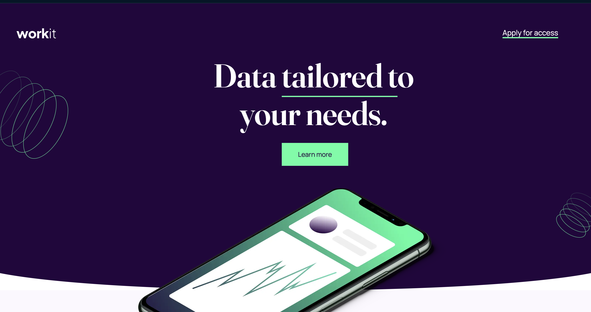

# Frontend Mentor - Workit landing page solution

This is a solution to the [Workit landing page challenge on Frontend Mentor](https://www.frontendmentor.io/challenges/workit-landing-page-2fYnyle5lu). Frontend Mentor challenges help you improve your coding skills by building realistic projects. 

## Table of contents

- [Overview](#overview)
  - [The challenge](#the-challenge)
  - [Screenshot](#screenshot)
  - [Links](#links)
- [My process](#my-process)
  - [Built with](#built-with)
  - [What I learned](#what-i-learned)
  - [Continued development](#continued-development)
  - [Useful resources](#useful-resources)
- [Author](#author)
- [Acknowledgments](#acknowledgments)

## Overview

### The challenge

Users should be able to:

- View the optimal layout for the interface depending on their device's screen size
- See hover and focus states for all interactive elements on the page

### Screenshot



### Links

- Solution URL: [Add solution URL here](https://your-solution-url.com)
- Live Site URL: [Add live site URL here](https://your-live-site-url.com)

## My process

Este proyecto es una **Landing Page** 
para la plataforma **Workit**, 
creado como parte del desafío de **Frontend Mentor**. 
El proyecto está construido con **HTML y CSS**, tiene un diseño **responsivo** y cuenta con efectos **hover** que mejoran la interacción del usuario.

### Built with

- Semantic HTML5 markup
- CSS custom properties
- Flexbox
- CSS Grid
- Mobile-first workflow

### What I learned

Al trabajar en el proyecto **Workit Landing Page**, pude reforzar y aprender varios conceptos clave en el desarrollo frontend. Estos son algunos de mis aprendizajes más destacados:


# 1° **Implementación de Diseño Responsivo**

Aprendí a usar **media queries** de manera eficiente para asegurar que la página se vea bien en dispositivos de diferentes tamaños, como móviles, tablets y pantallas grandes. Este código muestra cómo ajusté el diseño para pantallas pequeñas:

```
@media (max-width: 768px) {
  .container {
    grid-template-columns: 1fr;
    padding: 10px;
  }

  .hero-text {
    font-size: 1.5rem;
  }
}
```
Gracias a esto, pude asegurar una buena experiencia de usuario en dispositivos móviles, un aspecto clave en el desarrollo moderno.

# 2° Uso de Efectos Hover

El uso de **efectos hover** me permitió agregar interactividad en botones y enlaces, lo que mejora la experiencia del usuario al navegar por la página. Implementé efectos sutiles que mejoran la visibilidad de los elementos interactivos, como este ejemplo en los botones:
```
button:hover {
  background-color: #333;
  color: #fff;
  transform: scale(1.05);
  transition: all 0.3s ease;
}
```
Estos efectos añaden una capa de interactividad que hace que la página se sienta más viva y moderna.

# 3° Organización del Layout con Flexbox

En lugar de usar **CSS Grid**, opté por **Flexbox** para organizar el diseño de algunas secciones de la página. Esto me permitió una mayor flexibilidad para distribuir los elementos y asegurar que el contenido se ajustara adecuadamente a diferentes tamaños de pantalla:

```
.flex-container {
  display: flex;
  justify-content: space-between;
  align-items: center;
  gap: 20px;
}

.flex-item {
  flex: 1;
  text-align: center;
}
```
Utilizando Flexbox, logré una estructura más adaptable y controlada, permitiendo que los elementos se distribuyeran de manera uniforme y eficiente en la página.
# 4° Optimización del Código para Mejorar el Rendimiento

Finalmente, dediqué tiempo a optimizar el código CSS, asegurándome de reutilizar clases y mantener el código limpio. Esto no solo hizo que el proyecto fuera más mantenible, sino que también ayudó a mejorar el rendimiento general de la página.

### Continued development

A medida que sigo mejorando en el desarrollo frontend, me gustaría centrarme en las siguientes áreas para futuros proyectos:

1. Optimización de rendimiento
Si bien he logrado optimizar el código de este proyecto, quiero seguir profundizando en técnicas más avanzadas para mejorar el rendimiento de las páginas web, como la minificación de archivos, la carga diferida de imágenes y la optimización de recursos externos. Esto es fundamental para asegurar que los sitios sean más rápidos y eficientes, especialmente en dispositivos con conexión limitada.

2. Accesibilidad web
Un aspecto que quiero mejorar es la accesibilidad. En futuros proyectos, planeo aprender más sobre las mejores prácticas de accesibilidad (WCAG) para asegurar que todas las personas, incluidas aquellas con discapacidades, puedan navegar y utilizar el sitio sin problemas.

3. JavaScript y funcionalidad dinámica
Aunque este proyecto se centró principalmente en HTML y CSS, me gustaría integrar más JavaScript en futuros desarrollos para añadir interactividad y funcionalidades más avanzadas. La creación de elementos dinámicos, como menús interactivos y formularios más avanzados, es un área que planeo explorar más a fondo.

4. Componentización y herramientas modernas
Seguiré profundizando en herramientas y frameworks modernos, como React y Tailwind CSS, que permiten desarrollar de forma más eficiente y escalable. Quiero mejorar mis habilidades en la creación de componentes reutilizables para que mis proyectos sean más modulares y fáciles de mantener.

### Useful resources

- [FreeCodeCamp](https://www.freecodecamp.org/espanol/news/ejemplo-css-media-query-ancho-de-pantalla-max-y-min-para-diseno-adaptable-en-movil/) - Me sirvio para crear media query
- [Custom Shape Divider](https://www.shapedivider.app/) - Este pagina me ayudo a darme una idea para realizar las ondas

## Author

- Frontend Mentor - [@FrancisoRocha](https://www.frontendmentor.io/profile/FrancisoRocha)
- Instagram - [franciscorocha9_](https://www.instagram.com/franciscorocha9_/)
